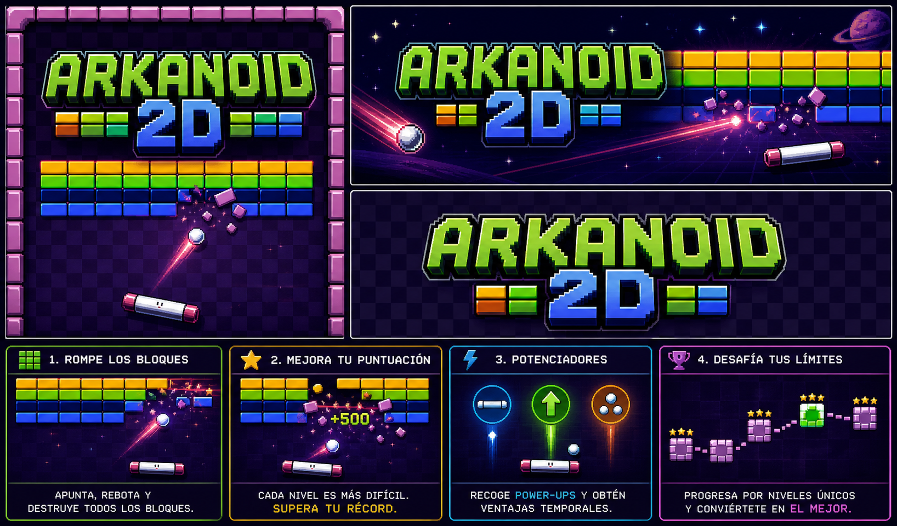

# U001_BrickBreaker_2D

[2022.1.4f1 in May 2023] migration to [6000.3.14f1 in May 2026]

## Summary

Playable prototype inspired by Arkanoid, developed in Unity. The project includes a functional one-level demo, with custom designs for the bricks, paddle, and ball. The main mechanic consists of controlling a horizontal paddle to hit the ball, destroy bricks, score points, and avoid losing all lives.

The project includes particle systems for collisions, scoring, a lives-based defeat system, progressive ball acceleration over time, and bricks with different durability levels represented by colors.

## Technologies

- Unity
- C#
- Unity 2D physics system
- Collider2D / Rigidbody2D
- Particle System
- Basic UI for score and lives
- Scoring system
- Lives system
- Git LFS
- GitHub Releases

## Main Features

- Gameplay inspired by Arkanoid 2D.
- Horizontal movement of the player-controlled paddle.
- Ball with 2D physics and bouncing behavior.
- Playable one-level demo.
- Custom designs for bricks, paddle, and ball.
- Particle system triggered on collisions.
- Scoring system based on brick destruction.
- Lives system and defeat condition.
- Progressive ball acceleration over time.
- Bricks with variable durability based on their color.
- Bricks are destroyed after receiving the required number of hits.
- Playable Windows build.

## Visuals

## Architecture

The main logic is divided into:

- `PlayerController` (Paddle)
- `BallManager` (Ball)
- `BlockManager` (Brick)
- `BaseManager` (Bottom fall detection)
- `AnimControl` (Particle systems)
- `GameManager` (Level flow control)

More information in:

`Docs/Architecture.md`

## Recommended Code to Review

`Project/Assets/Scripts/GameManager.cs` 

## Build

The build is available in GitHub Releases.

`Releases/Download.md` 

## Status

Playable project. The demo includes one functional level with a paddle, ball, destructible bricks, scoring, lives, defeat logic, and particle effects on collisions.

Possible future improvements:

- Add a main menu.
- Add a victory screen when completing the level.
- Add more levels.
- Add a pause system.
- Add sound effects for collisions and brick destruction.
- Add background music.
- Add power-ups.
- Improve the ball bounce behavior based on the impact point on the paddle.
- Add high score saving.
- Add transitions between levels.
- Improve the ball acceleration balance.
- Add animations or additional visual feedback for damaged bricks.

## Lessons Learned

This project allowed me to work on classic 2D gameplay mechanics in Unity, including `Rigidbody2D` physics, collision detection, player control, score management, lives system, and defeat logic.

It also helped me practice creating visual feedback through particle systems, designing bricks with variable durability, and implementing progressive difficulty through ball acceleration over time.

Additionally, the project helped me better understand how to structure a simple arcade prototype by separating responsibilities between the player paddle, the ball, the bricks, the global game systems, and the visual effects.